[README.md](https://github.com/user-attachments/files/32542752/README.md)

<code>open unit →</code> <a href="https://github.com/htmlshayan"><code>x-bot</code></a> <a href="https://github.com/htmlshayan"><code>ig-bot</code></a> <a href="https://github.com/htmlshayan"><code>spotify-bot</code></a>

  

  

